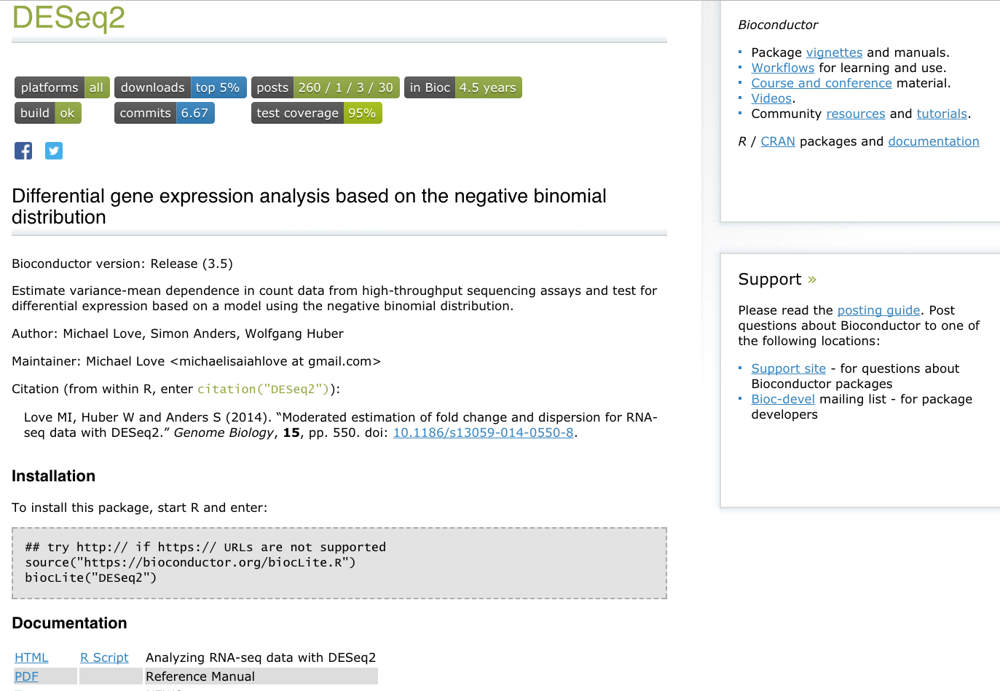
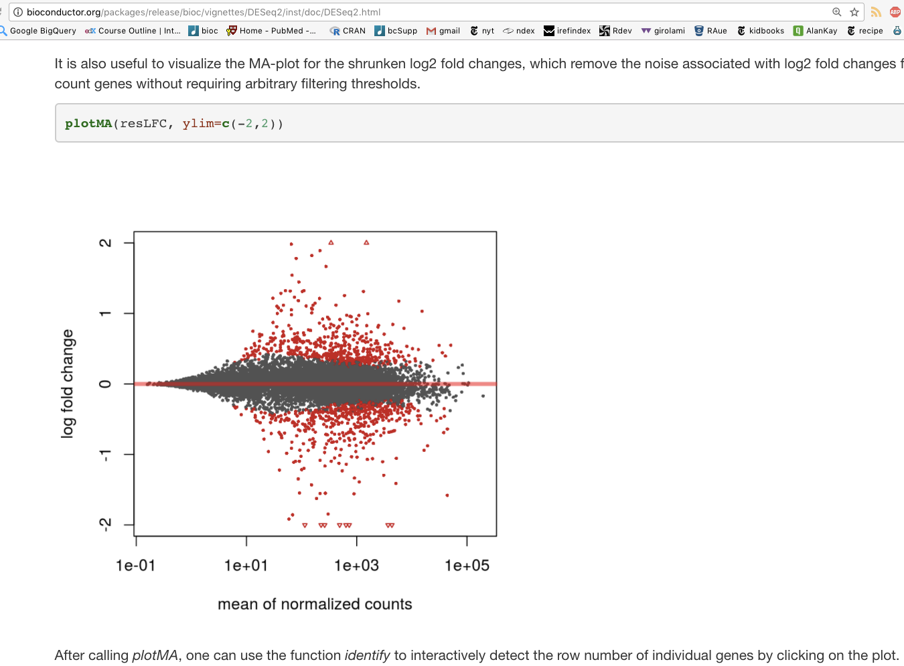

```{r setup,echo=FALSE,results="hide"}
suppressMessages({
suppressWarnings({
suppressPackageStartupMessages({
library(png)
library(grid)
library(Homo.sapiens)
library(GenomicRanges)
library(BSgenome.Hsapiens.UCSC.hg19)
library(RNAseqData.HNRNPC.bam.chr14)
library(GenomicAlignments)
library(Rsamtools)
library(ggbio)
})
})
})
```

# Bioconductor: R for statistical analysis of genome-scale experiments

- R: Fostering open development and community uptake of statistical methods in many fields
    - social and natural sciences are moving targets; statistical theory and computing environments likewise evolving rapidly
    - R: 
        - a programming language with established ease of uptake among scientists
        - software packaging: code, documentation, distribution 
        - package repositories
- CRAN: A repository for general statistical computing and visualization
- Bioconductor: An NHGRI-funded project, 16 years old, mobilizing R to address analysis of emerging genomic assays
    - enhanced package concept, with vignettes
    - formal object-oriented programming with S4
    - active developer/user community interacting through support site and conferences

<!--

- Concepts of functional object-oriented programming
- Modularity and versioning
- Reliability through (15 years of) continuous integration

-->

# Why R?

- Widely used to create algorithms that advance our ability to understand complex experimental data.
- Highly portable and interoperable, and fosters reuse of software components written in other languages. 

Basic idioms:

## interactive or scripted data capture and editing
```
df = read.csv([file reference])
plot(y~x, data=df)
cor.test(y~x, data=df)
```
## stepwise workflows
```
e1 = readCounts(...)
d1 = preprocess(e1, ...)
t1 = testDE(d1, ...)
```
## programming at the function level
```
mymeth = function(x, y, ...) { ... }
```
## programming at the package level: see devtools, package.skeleton

# R language packages and repositories: `cran.r-project.org`


This course assumes a good working knowledge of the R language.
The Rstudio environment is recommended.  If you want to
work through a tutorial before proceeding, 
[Try R](http://tryr.codeschool.com/) is very comprehensive.

# CRAN Task Views as portals to ideas and software


# Bioconductor: R for open development and analysis in genome biology


# BiocViews: task views for package discovery


# Package landing pages



# Vignette access pre-installation



# The Bioconductor support site


<!--

# Functional object-oriented programming

R combines functional and object-oriented programming paradigms.^[[Chambers 2014](https://projecteuclid.org/euclid.ss/1408368569)]

- In functional programming, notation and program activity mimic the
concept of function in mathematics.  For example
```
pow = function(x,y) = x^y      # primitives only
square = function(x) pow(x,2)  # reuse
```


# Object-oriented concept

Complexity of managing genomic annotation controlled through object design:

```{r lkho}
library(Homo.sapiens)
class(Homo.sapiens)   # we have an 'instance'
methods(class=class(Homo.sapiens))
```

# Packaging protocol

```
├── DESCRIPTION  (text file with metadata on provenance, licensing)
├── NAMESPACE    (text file defining imports and exports)
├── R            (folder for R source code)
├── README.md    (optional for github face page)
├── data         (folder for exemplary data)
├── man          (folder for detailed documentation)
├── tests        (folder for formal software testing code)
└── vignettes    (folder for high-level documentation)
    ├── biocOv1.Rmd
    ├── biocOv1.html
    └── wikiCentralDogma.png
```

# man pages and vignettes

- man pages formally document every function and data object
    - include runnable examples
- vignettes describe the use of multiple functions to explain the general value of the package
- man pages and vignettes are computable -- code can be included for execution at time of rendering

# Modularity and formal interdependence of packages

Some very useful packages carry out only a small number of
tasks, while others have very broad scope.  What is important
is that the package concept permits **modularization** of
software.  

- Modularization *of scope* is important to allow parallel independent
development of software tools that address distinct problems.
- Modularization *in time* is important to define collections of
versions of software whose behavior is confirmed and stable.

-->

# Continuous integration: testing package correctness and interoperability


```{r lkci,fig=TRUE,echo=FALSE,fig.wide=TRUE, fig.cap="Continuous integration report for Bioconductor devel branch.  All packages are checked every night on three major computing platforms."}
im = readPNG("buildRep.png")
grid.raster(im)
```


# Putting it together

## Core development process

Bioconductor's core developer group works hard to develop
data structures that allow users to work conveniently with
genomes and genome-scale data. 

- Parse large-scale assay data as produced by microarray or sequencer flow-cell scanners.
- Preprocess the (relatively) raw data to support reliable statistical interpretation.
- Combine assay quantifications with sample-level data to test hypotheses about relationships between molecular processes and organism-level characteristics such as growth, disease state.

## Community development process

- Open source licensing obligatory
- Open source code control (subversion to this point, soon to be git/github) in release and devel branches
- Package review process, CMD biocCheck

## Community support

- support.bioconductor.org is a BioStar-based framework for discussion with optional moderation
- conferences and training workshops are noted on the project site
